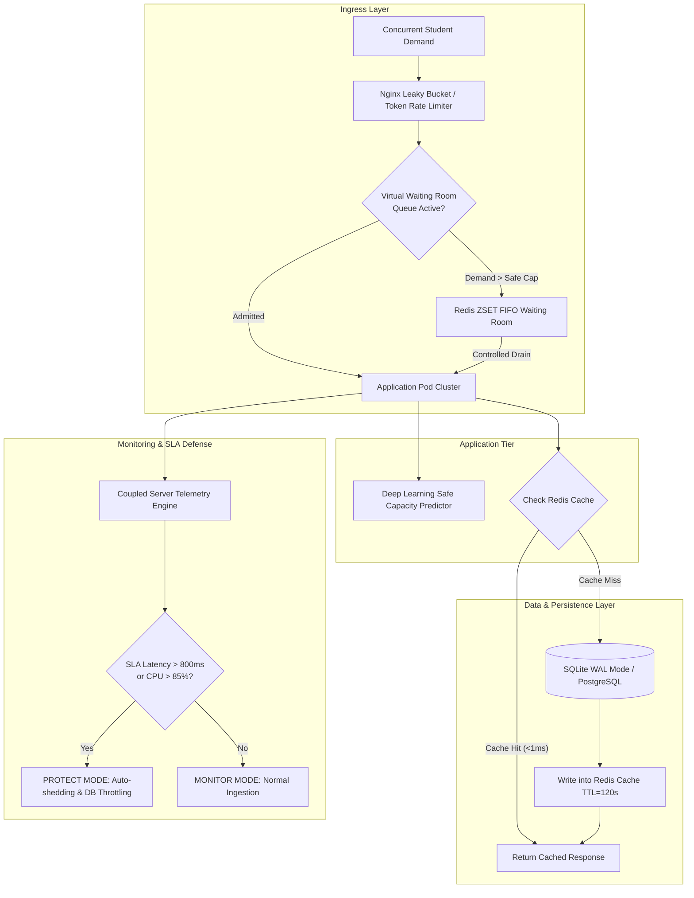

# PortalPulse Multi-Tier Architecture & Dataflow

```mermaid
flowchart TD
    subgraph Ingress Layer
        U[Concurrent Student Demand] --> N[Nginx Leaky Bucket / Token Rate Limiter]
        N --> VR{Virtual Waiting Room<br/>Queue Active?}
        VR -- "Demand > Safe Cap" --> Q[Redis ZSET FIFO Waiting Room]
        VR -- "Admitted" --> AP[Application Pod Cluster]
        Q -- "Controlled Drain" --> AP
    end

    subgraph Application Tier
        AP --> ML[Deep Learning Safe Capacity Predictor]
        AP --> RC{Check Redis Cache}
    end

    subgraph Data & Persistence Layer
        RC -- "Cache Hit (<1ms)" --> RET[Return Cached Response]
        RC -- "Cache Miss" --> DB[(SQLite WAL Mode / PostgreSQL)]
        DB --> WRC[Write into Redis Cache TTL=120s]
        WRC --> RET
    end

    subgraph Monitoring & SLA Defense
        AP --> TEL[Coupled Server Telemetry Engine]
        TEL --> SLA{SLA Latency > 800ms<br/>or CPU > 85%?}
        SLA -- "Yes" --> ACT[PROTECT MODE: Auto-shedding & DB Throttling]
        SLA -- "No" --> SAFE[MONITOR MODE: Normal Ingestion]
    end
```
